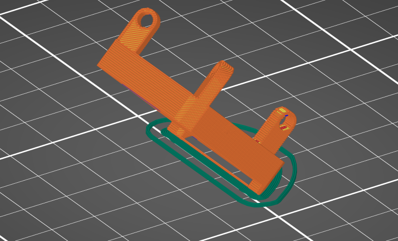

# knot 3D files

## Tips

### knot_top.stl

この部品だけサポートが必要です。  
ネジ穴の底にはサポートがつかないようにうまく設定すると印刷後の処理が楽です。

### knot_ball_holder.stl

斜めに印刷します。ブリムをつけるとより安定します。  
また、印刷後にブリムと左右を繋げている細い部分を切り取ります。

### knot_sw_plate

細い部分があります。ここだけ 0.25mm ノズル推奨です。

## license

This work is licensed under a [Creative Commons Attribution-NonCommercial-ShareAlike 4.0 International License](http://creativecommons.org/licenses/by-nc-sa/4.0/)

(c) 2025 Takuya Urakawa, 5z6p Instruments
