# knot trackball ビルドガイド

組み立て始める前に最後まで一通り目を通してください。

## バッテリー動作について

メイン基板上の電源スイッチは LiPo バッテリー接続時の電源スイッチです。  
バッテリー未接続の場合は電源スイッチは動作しません。

メイン基板に LiPo バッテリーのためのパッドが用意されていますが、  
`LiPoバッテリーを接続した場合`の動作や事故・怪我などは一切保証しません。  
自己責任でご利用ください。

もし取り付ける場合でも、必ず一度`USB接続で動作確認`してからをおすすめします。

## 付属している部品・別途必要な部品

### 付属している部品

|                                           | 個数         |
| ----------------------------------------- | ------------ |
| メイン基板                                | 1            |
| スイッチ基板                              | 1            |
| 電源スイッチ                              | 1            |
| PMW3610 と専用レンズ                      | 1            |
| フレキシブルフラットケーブル(8 ピン 60mm) | 1            |
| スイッチプレート                          | 1            |
| 組み立て済みボールホルダー                | 1            |
| トップケース・ボトムケース                | 1 セット     |
| ネジ類                                    | 下の表を参照 |

### 付属していない部品

|                                     | 個数 |
| ----------------------------------- | ---- |
| xiao nrf52840                       | 1    |
| 34mm トラックボール                 | 1    |
| choc v2 スイッチ(ピンが 2 本のもの) | 4    |
| キーキャップ(Doys がおすすめ！)     | 4    |

## 分解する

ケース、トラックボールホルダー、メイン基板、スイッチ基板は仮組みした状態になっています。  
ねじを外して分解してから組み立ててください。

- **ボールホルダーのベアリング部は分解する必要はありません。**

- **ケースを固定しているネジは樹脂用タッピングネジを使っています**  
  **使用に十分な強度はありますが、ネジのあけしめは優しくしてください**

## ネジの種類と位置

| 種類                     | 個数 | 場所                     |
| ------------------------ | ---- | ------------------------ |
| M2x4mm 皿タッピングネジ  | 4    | スイッチ基板             |
| M2x10mm 皿タッピングネジ | 3    | ボトムケース(MCU カバー) |
| M2x4mm 皿タッピングネジ  | 3    | ボトムケース             |
| M2x10mm 皿タッピングネジ | 1    | ボトムケース             |
| M2x8mm なべネジ          | 3    | ボールホルダー           |

## 組み立て

1. スイッチ基板のはんだづけ
   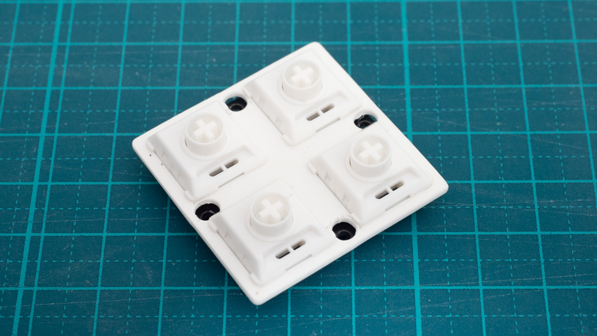
   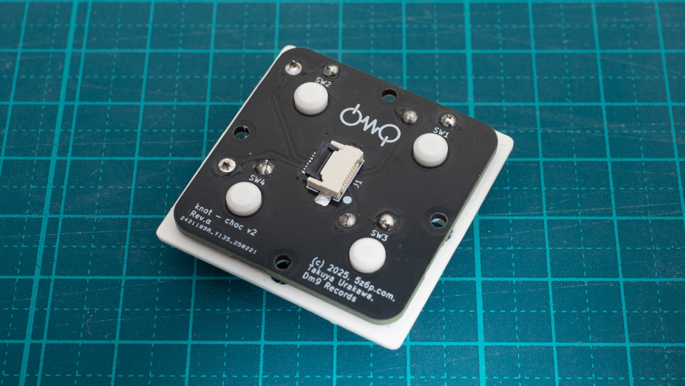

   スイッチ基板とスイッチをはんだづけします。
   プレートを通すのを忘れずに。

2. メイン基板のはんだづけ
   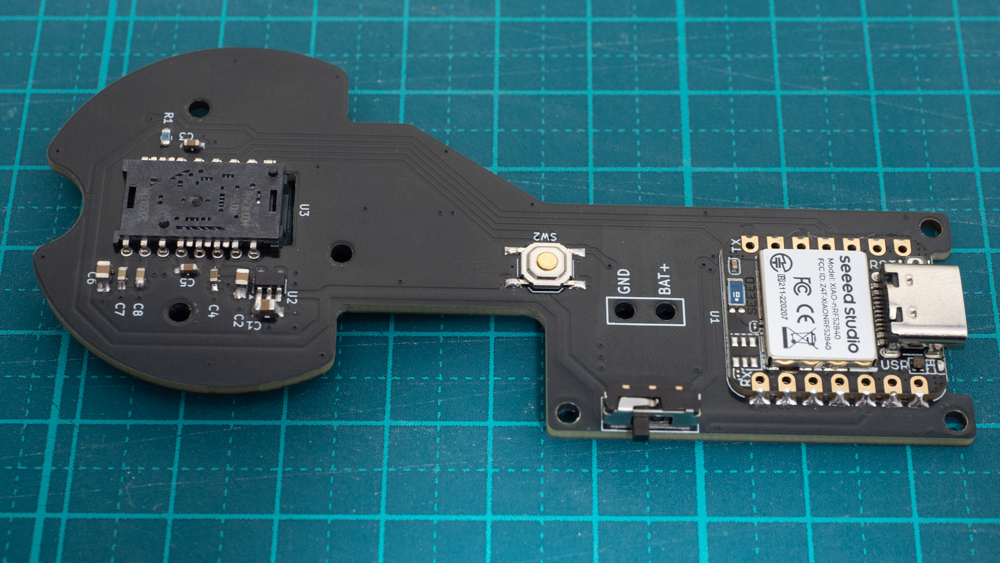
   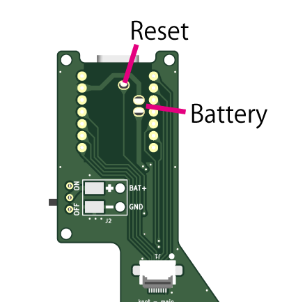

   メイン基板に、Xiao nrf52840 と電源スイッチ、マウスセンサーをはんだづけします

   - マウスセンサーの向きに注意してください
   - xiao の裏面、USB コネクタの下部分に`xiaoのReset`ピンをメイン基板に接続するためのパッドがあります。
     こちらをはんだづけすると`メイン基板下のリセットスイッチ`が使用できます。  
     はんだごてのコテ先の細いものを使って、xiao のパッドとメイン基板のスルーホールの側面をブリッジさせる感覚ではんだづけしてください。
   - xiao からバッテリー接続するためのパッドがあります。  
     バッテリー動作させない場合ははんだづけしなくても問題ありません。

3. マウスセンサーのレンズとトラックボールホルダー、ボトムケースをとりつける
   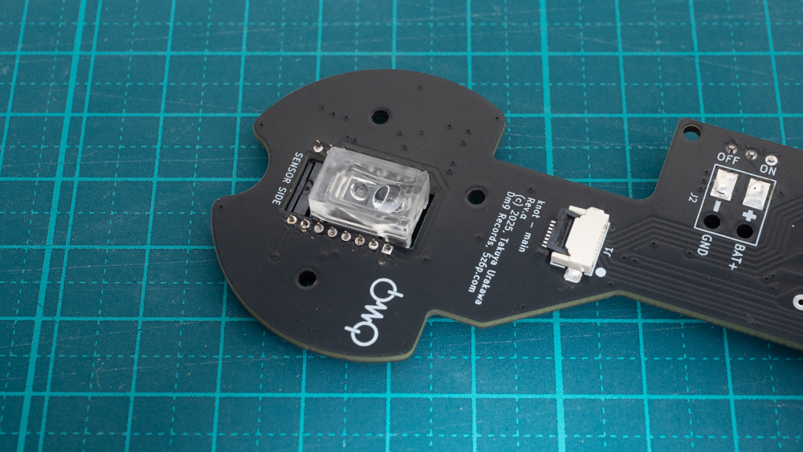
   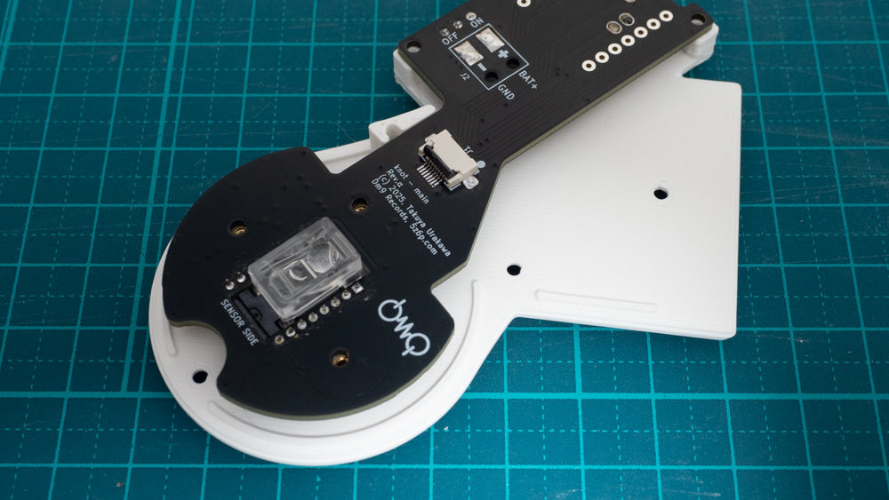

   マウスセンサーについている保護シールを剥がしてレンズを取り付けます。
   そのあと、トラックボールホルダーとメイン基板、ボトムケースをねじ止めします。

4. フラットケーブルで基板を接続する
   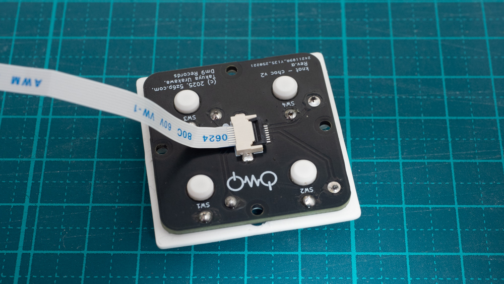
   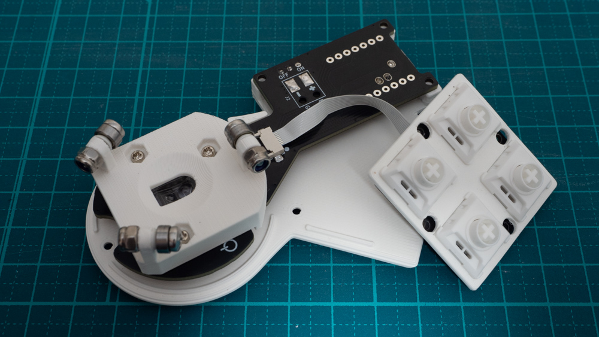

   フラットケーブルでメイン・スイッチ基板間を接続します。  
   フラットケーブルに向きはありませんが、ねじったりしないように気をつけてください。(基板上の ● があうように差し込んでください)
   **フラットケーブルコネクタは壊れやすいです**  
   留め具の開閉は十分注意してください。  
   また、フラットケーブルを接続した後は無理に引っ張ったりしないよう取り扱いに注意して動作確認をしてください。

## 動作確認

1. 電源がショートしていないか確認する
   xiao の電源ピンにテスターをあててショートしていないことを確認します。  
   VBUS-GND、3.3V-GND 間のどちらも確認してください
2. テスト用ファームウェアを書き込む
   マウスとキーボード(1・2・3・4 が入力される)操作をテストするためのファームウェアを用意しています。  
   xiao を書き込みモードにするためには、Reset ボタンを 2 回連続で押してください。  
   USB ストレージとして認識されるのでそこへファームウェアのファイルを書き込んでください。
   (TODO) ファームウェアの準備

## ケースの組み立て

1. メイン基板側のフラットケーブルを抜く
2. メイン基板とボトムケース、MCU カバーをねじ止めする
   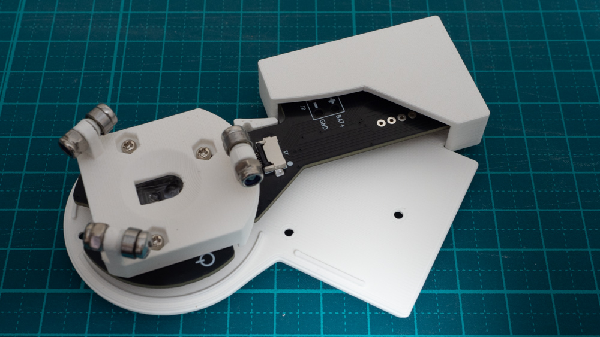

   **！ネジは全て締めすぎないように！**

   メイン基板に MCU カバーを被せて、ボトムケースの上にのせ、ネジでとめます。  
   MCU カバーが電源スイッチにひっかかって入りづらい場合は一度ボトムケースを取り外してください。

3. スイッチ基板とトップケースをねじ止めする
   1. スイッチ基板のプレートの穴からネジを差し込みます  
      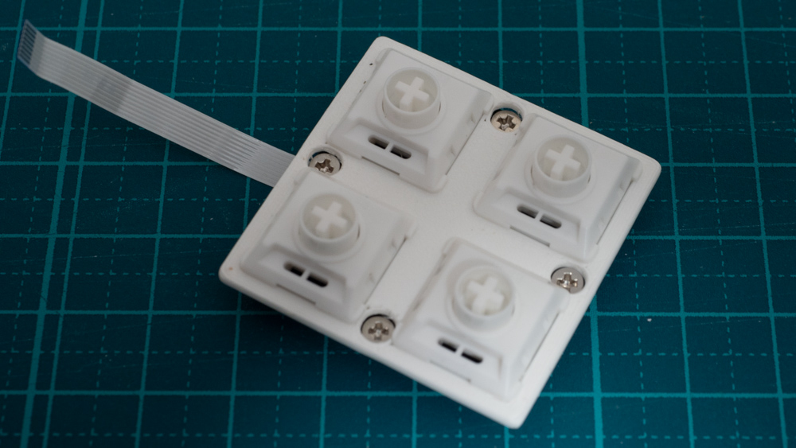  
      ドライバーで軽く押し込んで奥まで入ったことを確認してください
   2. フラットケーブルをトップケースの穴に通します
      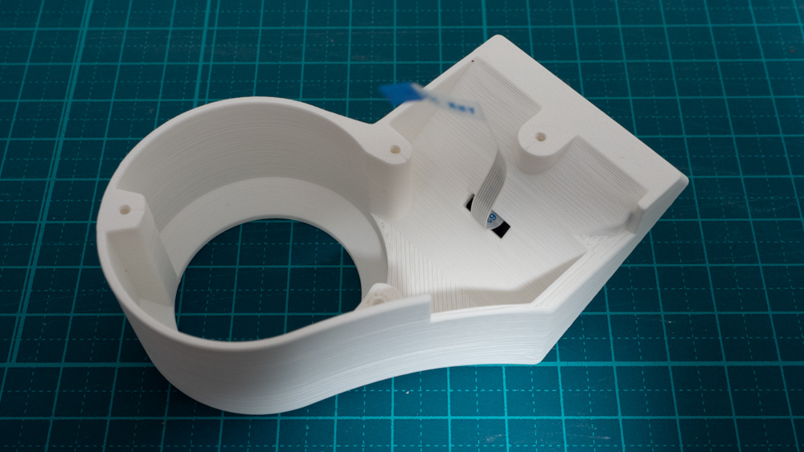
   3. スイッチ基板をネジ止めします  
      印刷精度の都合で空回りしてしまう場合があります。その場合は他のネジを慎重に締めてください。2 つ程度締まれば問題ありません。
4. メイン基板にフラットケーブルを差し込む
   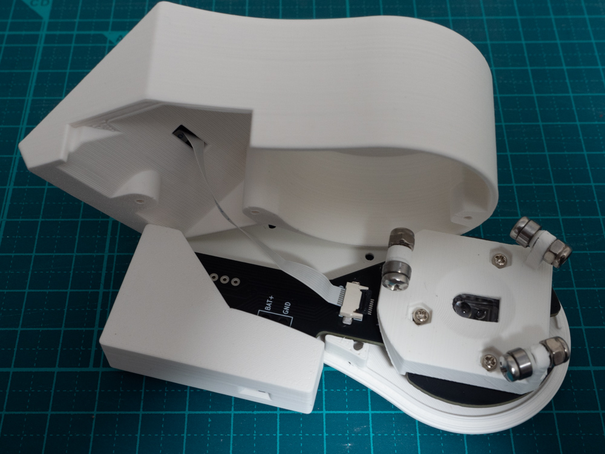

5. メインケースとボトムケースをねじ止めする  
   **フラットケーブルの扱いに注意**  
   フラットケーブルはうまく折りたたんで収納してください。  
   ケースに挟まない・ボールやベアリングに当たらない場所を探しくてください。

6. トラックボールホルダーの位置を調整する
   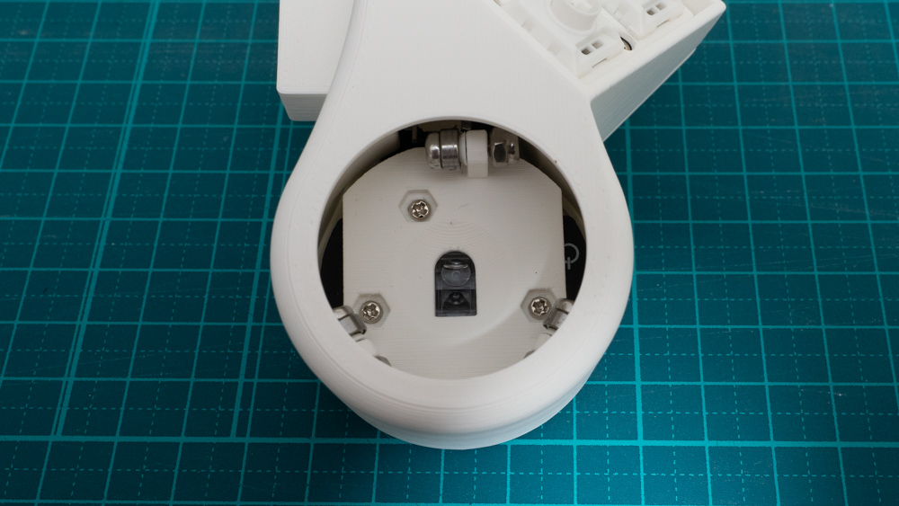

   ボールを乗せてトップケースと中心があっているか確認してください  
   ズレている場合はボールを取り外してボールホルダーのネジを全て緩めて調整してください  
   中心になったあと、もう一度ネジをしっかりしめます

7. ファームウェアを書き込む  
   メイン基板上のリセットスイッチはケース底面からアクセスできます

8. ゴム足をつける

## ファームウェアについて

https://github.com/hsgw/zmk-config-knot
